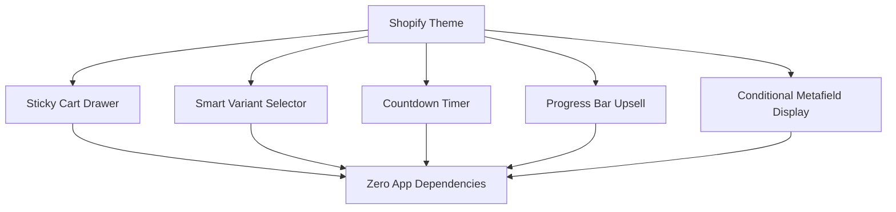

# Shopify Liquid Components


A production-ready library of custom Shopify Liquid components. Built natively for stores that need performance without third party app overhead. No monthly fees. No bloat. Just clean Liquid code that converts.

---

## The Problem This Solves

Most Shopify stores install apps for every feature. Sticky cart app. Variant selector app. Upsell app. Each one adds JavaScript overhead, slows your store, and costs monthly fees. This library replaces all of that with native Liquid components hardcoded directly into your theme.

---

## Components



---

## Component Library

| Component | Description | Replaces |
|---|---|---|
| Sticky Cart Drawer | AJAX slide out cart with upsells | $19/mo app |
| Smart Variant Selector | Image swapping variant buttons | $15/mo app |
| Countdown Timer | Urgency timer tied to metafields | $9/mo app |
| Progress Bar Upsell | Free shipping progress indicator | $12/mo app |
| Conditional Metafield Display | Dynamic content by product type | Custom dev |

---

## Sample Component

**Smart Variant Selector:**
```liquid


<div class="variant-selector">
  
    <div class="option-group">
      <label>{{ option.name }}</label>
      <div class="option-values">
        
          
          
            
              
            
          
          <button
            class="option-btn sold-out"
            data-value="{{ value }}"
            data-option="{{ option.name }}">
            {{ value }}
          </button>
        
      </div>
    </div>
  
</div>
```

---

## Quick Start

```bash
git clone https://github.com/Waynelynx12/shopify-liquid-components.git
```

Copy any component snippet into your Shopify theme under **Online Store > Themes > Edit Code > Snippets** and render it using:

```liquid

```

---

## Built By

Sheriff Wayne, Growth Engineer and Shopify Technical Specialist. I build native Liquid components for ecommerce stores that need conversion features without app dependency or monthly overhead.
